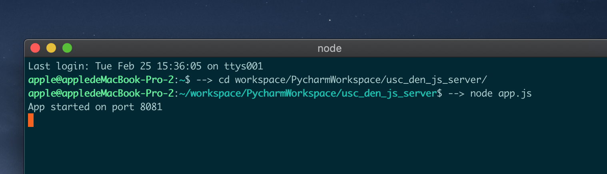
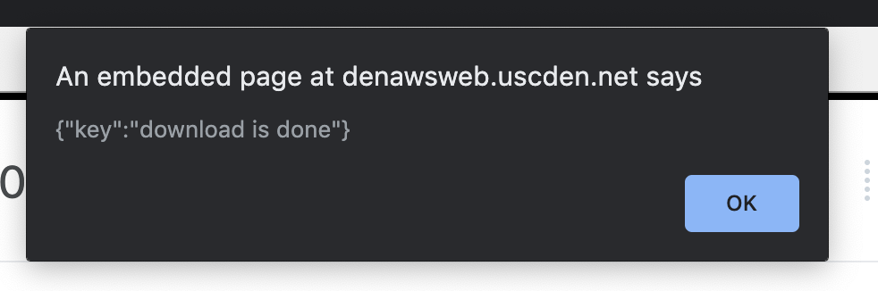

# usc-den-video-downloader
A easy tool to download usc den video using just one right click. Using tampermonkey and node.js

Download USC DEN lecture videos beyond limitations.

* `.ts` file format with H.264 and AAC coded.
* No expiration dates.
* No DEN Player needed.
* No anything but the lecture videos.

## Pre-requisites

* macOS/Linux (tested OK on macOS 10.11/10.12 and Ubuntu 14.04)
* Windows
* web broswer like chrome or firefox, can add tampermonkey extension

## Installation
#### Install tamperponkey
* Using the extension or add-on shop to install the tampermonkey

* Create a new script and then add the content of ___tamprmonkeyScript.js___ to it.
#### Install nodejs
* install nodejs and npm 
* install expressjs using following instruction: 
    ```
    npm install express --save
    ```
* install fluent-ffmpeg using following instruction: 
    ```
    npm install fluent-ffmpeg
    ```

## Usage
* Using terminal cd to the location of your ___app.js___ , run node app.js

* Log into USC DEN.
* Open any lecture video.
* Click the right button and then choose tampermonkey , and then choose the js as the image shows

* downloading process will be automatically started. After it finished, it will show alert like this:


## Change Storage Location
You can chage the lecture video to anywhere you want, just chagne line 36 of app.js


PS: Using relative or absolute route as you like

## Acknowledgements

This script is only for convenience of downloading lecture videos only. The author is not responsible for the use and its subsequence.

License: [MIT License](./LICENSE)